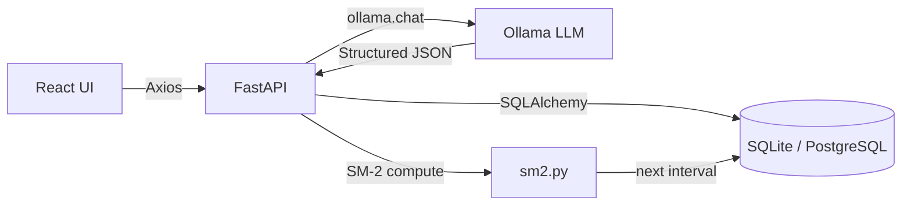

<div align="center">

  <!-- Logo / Hero -->
  

  # Flashie — AI-Powered Spaced Repetition

  **A full-stack vocabulary learning platform combining the SM-2 algorithm with local LLM intelligence.**

  [](https://react.dev/)
  [](https://www.typescriptlang.org/)
  [](https://vitejs.dev/)
  [](https://tailwindcss.com/)
  [](https://fastapi.tiangolo.com/)
  [](https://www.python.org/)
  [](https://www.sqlalchemy.org/)
  [](https://ollama.com/)

  <br />

  [Features](#-features) · [Architecture](#-architecture) · [Quick Start](#-quick-start) · [Roadmap](#-roadmap)

</div>

---

## 🎯 Why Flashie?

Most flashcard apps are either **too simple** (just flip cards) or **too bloated** (expensive subscriptions, cloud lock-in). Flashie hits the sweet spot:

| Problem | Flashie's Solution |
|---|---|
| Manually creating cards is tedious | 🤖 One-click AI generation via local LLMs |
| Generic review intervals | 🧠 SM-2 algorithm adapts to *your* memory |
| Privacy concerns with cloud AI | 🔒 100% local — Ollama runs on your machine |
| Boring flashcard UIs | ✨ Glassmorphism design with 3D flip animations |

---

## ✨ Features

### ✅ Implemented

<table>
  <tr>
    <td width="50%">
      <h4>🧠 SM-2 Spaced Repetition Engine</h4>
      <ul>
        <li>Scientifically-proven algorithm that schedules reviews at the optimal moment before you forget</li>
        <li>Adaptive Easiness Factor (EF) per card</li>
        <li>4-level self-assessment: <code>Forgot → Hard → OK → Easy</code></li>
        <li>Automatic interval progression: 1d → 6d → EF-scaled</li>
      </ul>
    </td>
    <td width="50%">
      <h4>🤖 AI Card Generation (Ollama)</h4>
      <ul>
        <li>Enter any topic or word → AI returns a complete flashcard</li>
        <li>Structured JSON output with front text, definition, pronunciation & example sentence</li>
        <li>Auto-creates decks by topic if they don't exist</li>
        <li>Works with any Ollama-compatible model (Llama 3, Mistral, Qwen, etc.)</li>
      </ul>
    </td>
  </tr>
  <tr>
    <td>
      <h4>🃏 Interactive 3D Flip Cards</h4>
      <ul>
        <li>CSS 3D transform with <code>perspective</code> and <code>preserve-3d</code></li>
        <li>Smooth cubic-bezier transition (0.55s)</li>
        <li>Front: vocabulary + pronunciation</li>
        <li>Back: definition + contextual example sentence</li>
      </ul>
    </td>
    <td>
      <h4>📊 Learning Analytics Dashboard</h4>
      <ul>
        <li>Daily learning streak tracker (🔥 fire streak)</li>
        <li>Total cards & decks overview</li>
        <li>7-day upcoming review forecast with bar chart</li>
        <li>Today's progress: reviewed vs. remaining</li>
      </ul>
    </td>
  </tr>
  <tr>
    <td>
      <h4>🗂️ Smart Deck Management</h4>
      <ul>
        <li>Create, edit, delete decks with modal dialogs</li>
        <li>Per-deck card counts and due-review badges</li>
        <li>Separate "Learn New" vs. "Review" workflows</li>
        <li>Responsive grid layout with hover micro-animations</li>
      </ul>
    </td>
    <td>
      <h4>✏️ Inline Card Editing</h4>
      <ul>
        <li>Double-click any card to edit in-place</li>
        <li>Live editing of front text, back text & example</li>
        <li>Duplicate detection before card creation</li>
        <li>Confirmation dialogs for destructive actions</li>
      </ul>
    </td>
  </tr>
  <tr>
    <td>
      <h4>🎨 Premium Dark UI</h4>
      <ul>
        <li>Glassmorphism design with <code>backdrop-blur</code></li>
        <li>Gradient borders, glow shadows & ambient light effects</li>
        <li>Staggered entrance animations (<code>fade-in-up</code>)</li>
        <li>Toast notifications & confirmation modals</li>
      </ul>
    </td>
    <td>
      <h4>⚡ Modern Developer Experience</h4>
      <ul>
        <li>Full TypeScript type safety across frontend</li>
        <li>Pydantic schema validation on backend</li>
        <li>Auto-generated API docs (Swagger UI at <code>/docs</code>)</li>
        <li>Hot reload on both frontend (Vite) and backend (Uvicorn)</li>
      </ul>
    </td>
  </tr>
</table>

---

## 🏗 Architecture

```
flashcards/
├── frontend/                 # React 19 + Vite + TypeScript
│   └── src/
│       ├── api/              # Axios HTTP client layer
│       │   ├── client.ts     #   └─ Base Axios instance
│       │   ├── decks.ts      #   └─ CRUD for decks
│       │   ├── cards.ts      #   └─ CRUD for cards
│       │   ├── review.ts     #   └─ Review & stats endpoints
│       │   └── ai.ts         #   └─ AI generation endpoint
│       ├── components/       # Reusable UI components
│       │   ├── FlipCard.tsx   #   └─ 3D flip card with rating
│       │   ├── DeckCard.tsx   #   └─ Deck preview card
│       │   ├── Navbar.tsx     #   └─ Navigation bar
│       │   └── NotificationProvider.tsx  # Toast & confirm system
│       ├── pages/            # Route-level page components
│       │   ├── HomePage.tsx   #   └─ Dashboard + AI generator
│       │   ├── DeckDetailPage.tsx  # └─ Card list + inline edit
│       │   ├── ReviewPage.tsx #   └─ Review session with progress
│       │   └── StatsPage.tsx  #   └─ Analytics & streak
│       └── types/            # Shared TypeScript interfaces
│
├── backend/                  # FastAPI + SQLAlchemy
│   └── app/
│       ├── main.py           # App entry, CORS, router registration
│       ├── database.py       # SQLAlchemy engine & session
│       ├── models/           # ORM models (Deck, Card, Review)
│       ├── schemas/          # Pydantic request/response schemas
│       ├── routers/          # API endpoint handlers
│       │   ├── decks.py      #   └─ /api/decks/*
│       │   ├── cards.py      #   └─ /api/decks/{id}/cards/*
│       │   ├── review.py     #   └─ /api/review/*
│       │   └── ai.py         #   └─ /api/ai/generate
│       └── services/         # Business logic
│           ├── sm2.py        #   └─ SM-2 algorithm implementation
│           └── ai_service.py #   └─ Ollama LLM integration
│
├── docs/                     # Documentation
│   └── AI_ROADMAP.md         # Detailed AI integration roadmap
├── start.bat                 # One-click launcher (Windows)
└── .env.example              # Environment template
```

### Data Flow



---

## 🚀 Quick Start

### Prerequisites

| Tool | Version | Required |
|---|---|---|
| Python | 3.12+ | ✅ |
| Node.js | 20+ | ✅ |
| [Ollama](https://ollama.com/) | latest | ⬜ Optional (for AI features) |

### 1️⃣ Clone

```bash
git clone https://github.com/HoangViet05/flashcards.git
cd flashcards
```

### 2️⃣ Backend

```bash
cd backend

# Create virtual environment (choose one)
python -m venv venv && venv\Scripts\activate     # Windows
conda create -n flashcard python=3.12 && conda activate flashcard  # Conda

# Install dependencies
pip install -r requirements.txt

# Seed sample data (first time only)
python seed.py

# Start server
uvicorn app.main:app --reload --port 8000
```

> 📍 API at `http://localhost:8000` — Swagger docs at `http://localhost:8000/docs`

### 3️⃣ Frontend

```bash
cd frontend
npm install
npm run dev
```

> 📍 App at `http://localhost:5173`

### 4️⃣ AI Features (Optional)

```bash
# Install Ollama from https://ollama.com
# Pull any model you prefer:
ollama pull llama3
# or
ollama pull mistral
```

The app auto-connects to the Ollama server at `localhost:11434`.

---

## 🧠 How SM-2 Works

The **SuperMemo-2** algorithm is the backbone of the review scheduling system:

```
┌─────────────────────────────────────────────────────┐
│  User reviews a card and rates: Forgot/Hard/OK/Easy │
│                                                     │
│  quality < 3 (Forgot)        quality ≥ 3            │
│  ┌──────────────────┐    ┌────────────────────────┐ │
│  │ Reset to start   │    │ Update Easiness Factor │ │
│  │ interval = 1 day │    │ EF' = EF + (0.1 -      │ │
│  │ repetitions = 0  │    │  (5-q)*(0.08+(5-q)*    │ │
│  └──────────────────┘    │  0.02))                │ │
│                          │                        │ │
│                          │ Calculate new interval │ │
│                          │ n=1: 1 day             │ │
│                          │ n=2: 6 days            │ │
│                          │ n>2: I(n-1) × EF       │ │
│                          └────────────────────────┘ │
└─────────────────────────────────────────────────────┘
```

| Rating | Quality | Behavior |
|---|---|---|
| 😵 Forgot | 0 | Card resets — you'll see it again tomorrow |
| 😓 Hard | 1 | Card resets — back to square one |
| 🙂 OK | 3 | Interval grows, EF stays stable |
| 😄 Easy | 5 | Interval grows aggressively, EF increases |

---

## 🛠 Tech Stack

| Layer | Technology | Purpose |
|---|---|---|
| **Frontend** | React 19, Vite 8, TypeScript | UI framework & build tool |
| **Styling** | TailwindCSS v4 | Utility-first CSS |
| **Routing** | React Router DOM v7 | Client-side navigation |
| **HTTP Client** | Axios | API communication |
| **Backend** | FastAPI | Async REST API framework |
| **ORM** | SQLAlchemy 2.0 | Database abstraction |
| **Validation** | Pydantic v2 | Request/Response schemas |
| **Database** | SQLite (dev) / PostgreSQL (prod) | Data persistence |
| **AI** | Ollama + configurable model | Local LLM inference |
| **Algorithm** | SM-2 (SuperMemo-2) | Spaced repetition scheduling |
| **Testing** | pytest + httpx | Backend API tests |

---

## 🗺 Roadmap

> This project is under **active development**. Below is the planned evolution from a vocabulary app to a full AI-powered learning platform.

### Phase 1 — Foundation ✅ **Complete**
- [x] Full CRUD for Decks & Cards
- [x] SM-2 spaced repetition engine
- [x] 3D flip card review interface
- [x] Learning analytics dashboard with streak tracking
- [x] Responsive glassmorphism dark UI
- [x] Inline double-click card editing
- [x] Toast notification & confirmation modal system
- [x] Local LLM integration (Ollama) for auto card generation
- [x] Separate "Learn new" vs. "Review due" workflows

### Phase 2 — Enhanced AI 🔨 **In Progress**
- [x] **Structured Output / Function Calling** — Migrate to OpenAI-compatible `response_format: json_schema` for more reliable outputs
- [x] **SSE Streaming** — Real-time token-by-token generation display (FastAPI SSE + `EventSource`)
- [x] **Batch Generation** — Generate multiple cards for a topic in one request
- [x] **Smart Prompting** — Context-aware prompts that avoid duplicating existing cards

### Phase 3 — RAG & PDF-Grounded Card Generation 🔮 **Planned**
- [ ] **PDF Upload & Extraction** — Upload scientific papers; swappable extractors (PyMuPDF, pdfplumber, docling) via strategy pattern
- [ ] **Chunking & Vector Embeddings** — Split documents into chunks, embed via configurable provider (Ollama local / OpenAI API) into ChromaDB
- [ ] **RAG Card Generation** — Retrieve relevant chunks → LLM generates vocabulary cards with example sentences cited directly from the paper `[Page X]`
- [ ] **Document Library UI** — Independent "Documents" page to manage uploaded PDFs (upload, list, delete, status tracking)
- [ ] **Semantic Search in Documents** — Search within a paper by meaning to find relevant passages
- [ ] **Reindex Endpoint** — Re-embed all documents when switching embedding models
- [ ] **Semantic Card Search** *(bonus)* — Find existing cards by meaning across all decks

### Phase 4 — Agentic Learning 🔮 **Planned**
- [ ] **LangGraph AI Tutor** — Agent that decides whether to create new cards, review old ones, or explain concepts
- [ ] **Error Pattern Analysis** — Detect why you keep forgetting certain cards and suggest mnemonics
- [ ] **Adaptive Difficulty** — ML model that replaces static SM-2 with personalized predictions

### Phase 5 — Multimodal 🔮 **Planned**
- [ ] **Pronunciation Scoring** — Record yourself → Whisper STT → AI grades your pronunciation
- [ ] **Text-to-Speech** — Native pronunciation playback on flip cards
- [ ] **Vision Card Creation** — Take a photo → GPT-4o Vision generates vocabulary cards from real objects

### Phase 6 — Production & MLOps 🔮 **Planned**
- [ ] **LLM Observability** — LangSmith/Langfuse tracing for cost & quality monitoring
- [ ] **Evaluation Pipeline** — Automated quality scoring of AI-generated cards
- [ ] **Fine-tuned Model** — LoRA/QLoRA fine-tuned model specialized for EN-VI vocabulary

> 📄 See [`docs/AI_ROADMAP.md`](docs/AI_ROADMAP.md) for the complete technical breakdown of each phase.

---

## 🤝 Contributing

Contributions are welcome! Feel free to open issues or submit pull requests.

1. Fork the repository
2. Create your feature branch (`git checkout -b feature/amazing-feature`)
3. Commit your changes (`git commit -m 'Add some amazing feature'`)
4. Push to the branch (`git push origin feature/amazing-feature`)
5. Open a Pull Request

---

## 📄 License

Distributed under the **MIT License**. See `LICENSE` for more information.

---

<div align="center">
  <sub>Built with 💜 by a developer passionate about AI, learning science & beautiful interfaces.</sub>
  <br />
  <sub>If this project helped or inspired you, consider giving it a ⭐!</sub>
</div>
