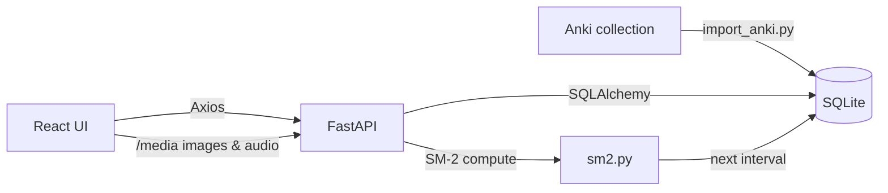

<div align="center">

  <!-- Logo / Hero -->
  

  # Flashie — Spaced Repetition Vocabulary Learning

  **A full-stack English vocabulary app powered by the SM-2 algorithm, shipping with the complete _4000 Essential English Words – Book 1_ deck: 600 words across 30 units with images, native audio and IPA transcriptions. Works 100% offline — AI-powered features are on the roadmap.**

  [](https://react.dev/)
  [](https://www.typescriptlang.org/)
  [](https://vitejs.dev/)
  [](https://tailwindcss.com/)
  [](https://fastapi.tiangolo.com/)
  [](https://www.python.org/)
  [](https://www.sqlalchemy.org/)
  [](https://ollama.com/)

  <br />

  [Features](#-features) · [Architecture](#-architecture) · [Quick Start](#-quick-start) · [Roadmap](#-roadmap)

</div>

---

## 🎯 Why Flashie?

Most flashcard apps are either **too simple** (just flip cards) or **too bloated** (expensive subscriptions, cloud lock-in). Flashie hits the sweet spot:

| Problem | Flashie's Solution |
|---|---|
| Manually creating cards is tedious | 📦 600 curated words imported out of the box (one-click AI generation coming soon) |
| Generic review intervals | 🧠 SM-2 algorithm adapts to *your* memory |
| Text-only cards are hard to remember | 🔊 Every word ships with an image, IPA transcription and native audio |
| Privacy concerns with cloud services | 🔒 100% local & offline — your data never leaves your machine |
| Boring flashcard UIs | ✨ Glassmorphism design with 3D flip animations |

---

## ✨ Features

### ✅ Implemented

<table>
  <tr>
    <td width="50%">
      <h4>🧠 SM-2 Spaced Repetition Engine</h4>
      <ul>
        <li>Scientifically-proven algorithm that schedules reviews at the optimal moment before you forget</li>
        <li>Adaptive Easiness Factor (EF) per card</li>
        <li>4-level self-assessment: <code>Forgot → Hard → OK → Easy</code></li>
        <li>Automatic interval progression: 1d → 6d → EF-scaled</li>
      </ul>
    </td>
    <td width="50%">
      <h4>📦 4000 Essential English Words Built-in</h4>
      <ul>
        <li>Complete Book 1 deck: 600 words across 30 unit decks (20 words each)</li>
        <li>Each card: word, IPA transcription, Vietnamese meaning, English definition & example sentence</li>
        <li>Native audio for word & example + illustrative image per word</li>
        <li>One-time import script from the original Anki collection</li>
      </ul>
    </td>
  </tr>
  <tr>
    <td>
      <h4>🃏 Interactive 3D Flip Cards</h4>
      <ul>
        <li>CSS 3D transform with <code>perspective</code> and <code>preserve-3d</code></li>
        <li>Front: vocabulary + IPA transcription + 🔊 audio playback</li>
        <li>Back: Vietnamese meaning, English definition, example sentence (with audio) & image</li>
        <li>Smooth cubic-bezier transition (0.55s)</li>
      </ul>
    </td>
    <td>
      <h4>📊 Learning Analytics Dashboard</h4>
      <ul>
        <li>Daily learning streak tracker (🔥 fire streak)</li>
        <li>Total cards & decks overview</li>
        <li>7-day upcoming review forecast with bar chart</li>
        <li>Today's progress: reviewed vs. remaining</li>
      </ul>
    </td>
  </tr>
  <tr>
    <td>
      <h4>🗂️ Smart Deck Management</h4>
      <ul>
        <li>Create, edit, delete decks with modal dialogs</li>
        <li>Per-deck card counts and due-review badges</li>
        <li>Separate "Learn New" vs. "Review" workflows</li>
        <li>Responsive grid layout with hover micro-animations</li>
      </ul>
    </td>
    <td>
      <h4>✏️ Inline Card Editing</h4>
      <ul>
        <li>Double-click any card to edit in-place</li>
        <li>Live editing of front text, back text & example</li>
        <li>Duplicate detection before card creation</li>
        <li>Confirmation dialogs for destructive actions</li>
      </ul>
    </td>
  </tr>
  <tr>
    <td>
      <h4>🎨 Premium Dark UI</h4>
      <ul>
        <li>Glassmorphism design with <code>backdrop-blur</code></li>
        <li>Gradient borders, glow shadows & ambient light effects</li>
        <li>Staggered entrance animations (<code>fade-in-up</code>)</li>
        <li>Toast notifications & confirmation modals</li>
      </ul>
    </td>
    <td>
      <h4>⚡ Modern Developer Experience</h4>
      <ul>
        <li>Full TypeScript type safety across frontend</li>
        <li>Pydantic schema validation on backend</li>
        <li>Auto-generated API docs (Swagger UI at <code>/docs</code>)</li>
        <li>Hot reload on both frontend (Vite) and backend (Uvicorn)</li>
      </ul>
    </td>
  </tr>
</table>

### 🔮 Coming Soon

AI-powered features — one-click card generation via local LLMs (Ollama), PDF-grounded card creation (RAG), and a daily tutor agent — are designed and partially built, but **intentionally paused** so the core learning experience ships solid first. They show up in the UI with a "Sắp ra mắt ✨" badge and the code stays in the repo. See the full [Roadmap](#-roadmap).

---

## 🏗 Architecture

```
flashcards/
├── frontend/                 # React 19 + Vite + TypeScript
│   └── src/
│       ├── api/              # Axios HTTP client layer
│       │   ├── client.ts     #   └─ Base Axios instance
│       │   ├── decks.ts      #   └─ CRUD for decks
│       │   ├── cards.ts      #   └─ CRUD for cards
│       │   ├── review.ts     #   └─ Review & stats endpoints
│       │   └── ai.ts         #   └─ AI generation endpoint
│       ├── components/       # Reusable UI components
│       │   ├── FlipCard.tsx   #   └─ 3D flip card with rating
│       │   ├── DeckCard.tsx   #   └─ Deck preview card
│       │   ├── Navbar.tsx     #   └─ Navigation bar
│       │   └── NotificationProvider.tsx  # Toast & confirm system
│       ├── pages/            # Route-level page components
│       │   ├── HomePage.tsx   #   └─ Dashboard + AI generator
│       │   ├── DeckDetailPage.tsx  # └─ Card list + inline edit
│       │   ├── ReviewPage.tsx #   └─ Review session with progress
│       │   └── StatsPage.tsx  #   └─ Analytics & streak
│       └── types/            # Shared TypeScript interfaces
│
├── backend/                  # FastAPI + SQLAlchemy
│   ├── app/
│   │   ├── main.py           # App entry, CORS, routers, /media static files
│   │   ├── database.py       # SQLAlchemy engine, session & lightweight migration
│   │   ├── models/           # ORM models (Deck, Card, Review)
│   │   ├── schemas/          # Pydantic request/response schemas
│   │   ├── routers/          # API endpoint handlers
│   │   │   ├── decks.py      #   └─ /api/decks/*
│   │   │   ├── cards.py      #   └─ /api/decks/{id}/cards/*
│   │   │   ├── review.py     #   └─ /api/review/*
│   │   │   └── ai.py         #   └─ /api/ai/generate (paused)
│   │   └── services/         # Business logic
│   │       ├── sm2.py        #   └─ SM-2 algorithm implementation
│   │       ├── anki_parser.py#   └─ 4000 Essential Words note parser
│   │       └── ai_service.py #   └─ Ollama LLM integration (paused)
│   ├── import_anki.py        # One-time dataset import script
│   └── data/media/           # Card images & audio (gitignored, ~120MB)
│
├── extracted_anki/           # Raw Anki collection + media (gitignored)
├── docs/                     # Documentation
│   └── AI_ROADMAP.md         # Detailed AI integration roadmap
├── start.bat                 # One-click launcher (Windows)
└── .env.example              # Environment template
```

### Data Flow



---

## 🚀 Quick Start

### Prerequisites

| Tool | Version | Required |
|---|---|---|
| Python | 3.12+ | ✅ |
| Node.js | 20+ | ✅ |
| [Ollama](https://ollama.com/) | latest | ⬜ Not needed (only for future AI features) |

### 1️⃣ Clone

```bash
git clone https://github.com/HoangViet05/flashcards.git
cd flashcards
```

### 2️⃣ Backend

```bash
cd backend

# Create virtual environment (choose one)
python -m venv venv && venv\Scripts\activate     # Windows
conda create -n flashcard python=3.12 && conda activate flashcard  # Conda

# Install dependencies
pip install -r requirements.txt

# Import the 4000 Essential English Words deck (first time only)
python import_anki.py

# Optional: extra sample decks
python seed.py

# Start server
uvicorn app.main:app --reload --port 8000
```

> 📍 API at `http://localhost:8000` — Swagger docs at `http://localhost:8000/docs`

### 3️⃣ Frontend

```bash
cd frontend
npm install
npm run dev
```

> 📍 App at `http://localhost:5173`

### 4️⃣ Start Learning

Open `http://localhost:5173`, pick a unit deck (each has 20 new words), hit **"Học từ mới"**, flip cards, listen to the audio and rate yourself. Come back tomorrow — SM-2 schedules the reviews for you. 🔥

> 💡 AI features (card generation, PDF import) are currently paused and marked "Sắp ra mắt ✨" in the UI. When they return, they'll only need a local Ollama install.

---

## 🧠 How SM-2 Works

The **SuperMemo-2** algorithm is the backbone of the review scheduling system:

```
┌─────────────────────────────────────────────────────┐
│  User reviews a card and rates: Forgot/Hard/OK/Easy │
│                                                     │
│  quality < 3 (Forgot)        quality ≥ 3            │
│  ┌──────────────────┐    ┌────────────────────────┐ │
│  │ Reset to start   │    │ Update Easiness Factor │ │
│  │ interval = 1 day │    │ EF' = EF + (0.1 -      │ │
│  │ repetitions = 0  │    │  (5-q)*(0.08+(5-q)*    │ │
│  └──────────────────┘    │  0.02))                │ │
│                          │                        │ │
│                          │ Calculate new interval │ │
│                          │ n=1: 1 day             │ │
│                          │ n=2: 6 days            │ │
│                          │ n>2: I(n-1) × EF       │ │
│                          └────────────────────────┘ │
└─────────────────────────────────────────────────────┘
```

| Rating | Quality | Behavior |
|---|---|---|
| 😵 Forgot | 0 | Card resets — you'll see it again tomorrow |
| 😓 Hard | 1 | Card resets — back to square one |
| 🙂 OK | 3 | Interval grows, EF stays stable |
| 😄 Easy | 5 | Interval grows aggressively, EF increases |

---

## 🛠 Tech Stack

| Layer | Technology | Purpose |
|---|---|---|
| **Frontend** | React 19, Vite 8, TypeScript | UI framework & build tool |
| **Styling** | TailwindCSS v4 | Utility-first CSS |
| **Routing** | React Router DOM v7 | Client-side navigation |
| **HTTP Client** | Axios | API communication |
| **Backend** | FastAPI | Async REST API framework |
| **ORM** | SQLAlchemy 2.0 | Database abstraction |
| **Validation** | Pydantic v2 | Request/Response schemas |
| **Database** | SQLite (dev) / PostgreSQL (prod) | Data persistence |
| **AI** | Ollama + configurable model | Local LLM inference |
| **Algorithm** | SM-2 (SuperMemo-2) | Spaced repetition scheduling |
| **Testing** | pytest + httpx | Backend API tests |

---

## 🗺 Roadmap

> This project is under **active development**. Below is the planned evolution from a vocabulary app to a full AI-powered, agent-driven English learning platform. Three core themes drive this roadmap: **RAG**, **MCP**, and **a Daily Tutor Agent**.

### Phase 1 — Foundation ✅ **Complete**
- [x] Full CRUD for Decks & Cards
- [x] SM-2 spaced repetition engine
- [x] 3D flip card review interface
- [x] Learning analytics dashboard with streak tracking
- [x] Responsive glassmorphism dark UI
- [x] Inline double-click card editing
- [x] Toast notification & confirmation modal system
- [x] Local LLM integration (Ollama) for auto card generation
- [x] Separate "Learn new" vs. "Review due" workflows

### Phase 2 — Enhanced AI + Evaluation Foundation 🔨 **In Progress**
- [x] **Structured Output / Function Calling** — Migrate to OpenAI-compatible `response_format: json_schema` for more reliable outputs
- [x] **SSE Streaming** — Real-time token-by-token generation display (FastAPI SSE + `EventSource`)
- [x] **Batch Generation** — Generate multiple cards for a topic in one request
- [x] **Smart Prompting** — Context-aware prompts that avoid duplicating existing cards
- [x] **Rich Card Media (Schema + UI)** — `Card` model extended with pronunciation, English definition, image & audio URLs; flip card shows image and plays word/example audio; static asset serving via FastAPI at `/media`
- [x] **Anki Dataset Ingestion (with Assets)** — 600 cards / 30 unit decks with 1,800 media files imported from `extracted_anki/` via `import_anki.py` (golden eval set still pending)
- [ ] **Evaluation Pipeline** — LLM-as-judge scoring + golden dataset (curated from Anki) + pytest regression tests on every generation prompt change
- [ ] **LLM Observability** — Langfuse self-hosted: trace every LLM call with latency, token cost, prompt version
- 📊 **Metrics:** LLM-judge score ≥ 4.0/5 on golden set, p95 latency < 3s, regression test gate in CI

### Phase 3 — RAG over English Learning Content 🔨 **In Progress**
- [x] **PDF Upload & Extraction** — Upload PDFs via drag-and-drop; PyMuPDF extracts text & page count; stored in `data/uploads/`
- [x] **Document Library UI** — Independent `/documents` page to manage uploaded PDFs (upload, list, delete, status tracking)
- [ ] **Multi-format Ingestion** — Beyond PDF: novels (`.epub`), articles (URL), subtitles (`.srt`), song lyrics, course transcripts
- [ ] **Chunking & Vector Embeddings** — Split documents into ~500-token chunks (50 overlap), embed via configurable provider (Ollama `nomic-embed-text` / OpenAI) into ChromaDB
- [ ] **RAG Card Generation** — Retrieve top-K relevant chunks → LLM generates flashcards with example sentences cited directly from the source `[Source: Title, Page X]`
- [ ] **Cross-encoder Re-ranking** — Re-rank top-K with a small cross-encoder for retrieval precision (depth over a basic RAG)
- [ ] **Semantic Search in Documents** — Search within a document by meaning
- [ ] **Semantic Card Search** — Find existing cards by meaning across all decks (`cards_global` collection)
- [ ] **Reindex Endpoint** — Re-embed all documents when switching embedding models
- 📊 **Metrics:** Retrieval MRR@5, NDCG@10 on a hand-labeled query set; citation accuracy (manual audit)

### Phase 4 — MCP Server 🔮 **Planned**
> Expose Flashie as a Model Context Protocol server so external clients (Claude Desktop, Cursor, Zed) can read/write the deck.
- [ ] **MCP Server Skeleton** — Python MCP server with stdio + SSE transports, packaged separately from FastAPI
- [ ] **Resources** — `card://{id}`, `deck://{id}`, `document://{id}` exposed as MCP resources
- [ ] **Tools** — `search_cards`, `create_card`, `get_due_cards`, `record_review`, `get_stats`, `generate_from_topic`, `search_in_document`
- [ ] **Prompts** — Built-in prompt templates: "Drill me on weak cards", "Explain this card with mnemonics"
- [ ] **Auth & Scoping** — Token-based auth so external clients only see their own decks
- 📊 **Metrics:** Tool call success rate, end-to-end demo with Claude Desktop creating cards into the live database

### Phase 5 — Daily English Tutor Agent 🔮 **Planned**
> The headline feature: an agent that helps you learn English every day, end-to-end. Built on top of MCP tools from Phase 4.
- [ ] **LangGraph Agent Core** — State machine with persistent memory (per-user profile: level, weak topics, schedule)
- [ ] **Daily Routine Workflow** — Morning trigger: greet user → run due review → suggest N new words at user's level → end-of-day recap
- [ ] **Conversation Mode** — Free chat in English; agent silently captures words the user struggles with → proposes new cards
- [ ] **Error Pattern Analysis** — Cross-card analysis: "you keep mixing up *affect/effect*" → propose targeted mnemonic card
- [ ] **Tool Orchestration via MCP** — Agent uses the same MCP tools from Phase 4 (single source of truth)
- [ ] **Conversation Trace UI** — Frontend page that visualizes agent decisions step-by-step (educational + debugging)
- 📊 **Metrics:** Agent task success rate (LLM-as-judge), tools-per-task, % of agent-suggested cards user accepts

### Phase 6 — Custom ML 🔮 **Planned**
> Where I prove I can do real AI engineering, not just call APIs.
- [ ] **LLM Distillation for Card Generation** — Distill GPT-4o card outputs into a 1-3B local model (Llama 3.2 / Phi-3 / Qwen 2.5) using Anki + synthetic data, LoRA/QLoRA fine-tuning, exported to GGUF and served via Ollama. **Goal: same quality as GPT-4o, $0/card, < 1s latency.**
- [ ] **Embedding Fine-tuning** *(conditional on Phase 3 retrieval metrics being weak)* — Fine-tune `nomic-embed-text` on (word, definition, example) triples from Anki to improve domain retrieval
- [ ] **Adaptive Difficulty** — Replace static SM-2 with a learned model (gradient boosting on review history features) that predicts forget probability per card
- [ ] **A/B Framework** — Run learned-model vs. SM-2 in parallel and compare retention
- 📊 **Metrics:** Distill model BLEU & LLM-judge score vs. GPT-4o reference, latency, $/1K cards, retention lift over SM-2 baseline

### Phase 7 — Multimodal (Local-first) 🔮 **Planned**
> Phase 2 supports displaying image/audio that already exist on a card. Phase 7 is about **generating new** image/audio for cards that don't have any (cards from Phase 3 RAG, Phase 5 agent, manual creation).
- [ ] **TTS for New Cards** — Local TTS (Coqui XTTS / OpenVoice) auto-generates audio for any card without one; cached to disk
- [ ] **Image for New Cards** — Pluggable provider: Unsplash/Pexels API for stock photo lookup, or local Stable Diffusion (SDXL-Turbo) for synthesized images
- [ ] **Speech-to-Text** — Local Whisper for user-recorded pronunciation
- [ ] **Pronunciation Scoring** — Compare user audio vs. reference (Anki MP3 or generated TTS) using phoneme-level alignment
- [ ] **Vision Card Creation** — Local VLM (Qwen2.5-VL / Llama 3.2 Vision) generates vocab cards from photos — keeps the "100% local" promise

### Phase 8 — Production & MLOps 🔮 **Planned**
- [ ] **Containerization** — `docker-compose` for full stack (frontend, backend, Ollama, ChromaDB, Langfuse)
- [ ] **Model Serving** — Migrate fine-tuned models to vLLM or TGI for production-grade throughput
- [ ] **CI/CD with Eval Gate** — GitHub Actions: lint → tests → eval pipeline must pass before merge
- [ ] **Monitoring Dashboard** — Grafana with key metrics from Langfuse + custom learning analytics
- [ ] **Cost Dashboard** — Track $/active user across all LLM calls

> 📄 See [`docs/AI_ROADMAP.md`](docs/AI_ROADMAP.md) for the complete technical breakdown of each phase.

---

## 🤝 Contributing

Contributions are welcome! Feel free to open issues or submit pull requests.

1. Fork the repository
2. Create your feature branch (`git checkout -b feature/amazing-feature`)
3. Commit your changes (`git commit -m 'Add some amazing feature'`)
4. Push to the branch (`git push origin feature/amazing-feature`)
5. Open a Pull Request

---

## 📄 License

Distributed under the **MIT License**. See `LICENSE` for more information.

---

<div align="center">
  <sub>Built with 💜 by a developer passionate about AI, learning science & beautiful interfaces.</sub>
  <br />
  <sub>If this project helped or inspired you, consider giving it a ⭐!</sub>
</div>
